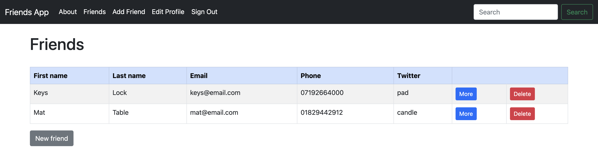
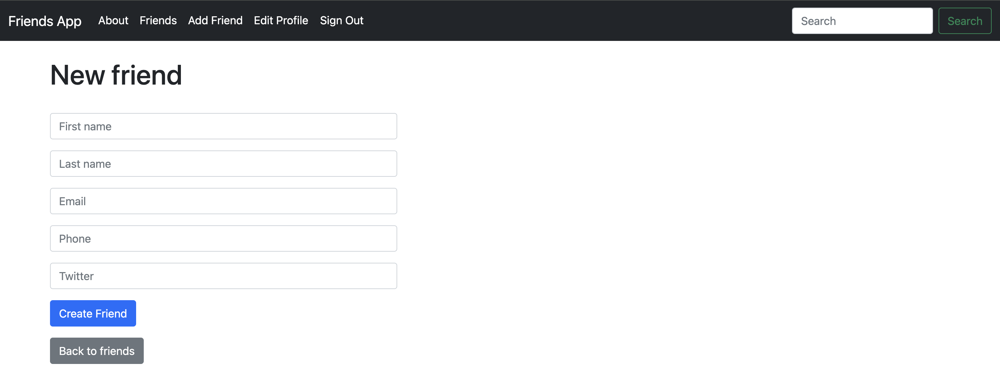

## Why am I learning Rails?

After recently finishing my last solo project using Django, I've decided to learn Ruby on Rails (Rails). This is my first time coding in Ruby. I chose Rails because it's known for helping developers build web applications quickly and easily. Learning Rails will add feathers to my bow and it's also a step towards becoming a more well-rounded developer. Many companies look for developers who know more than one framework, so knowing both Django and Rails can open up new job opportunities for me. By getting into Rails, I hope to improve my skills in building web applications and increase my value as a developer in the tech industry.

## This Project

For this project, I've built a friends web app using Ruby on Rails and Bootstrap. The primary purpose behind this project is to become familiar with the CRUD operations in Rails.

    

    

